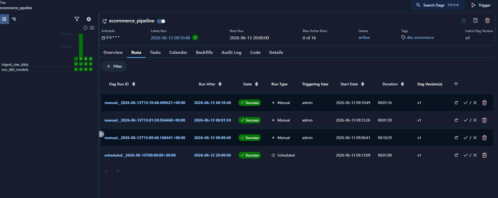
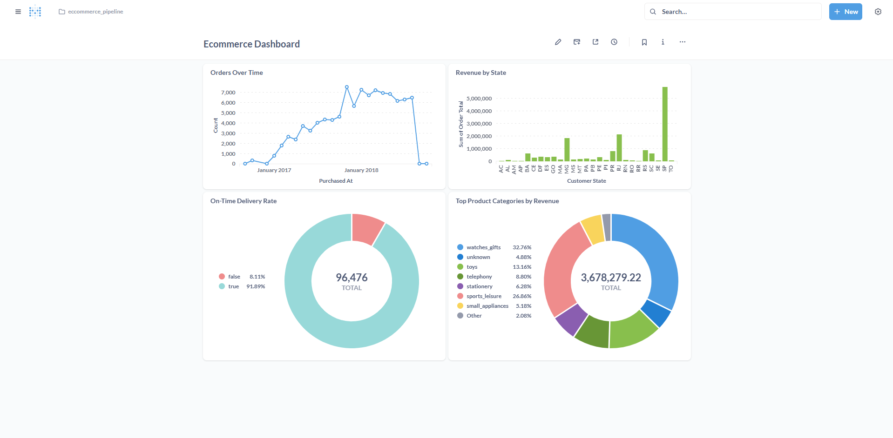

# E-commerce Data Pipeline

End-to-end data pipeline using the Brazilian E-commerce (Olist) dataset — 
from raw CSVs to an automated, modeled warehouse with dashboards.

## Architecture

CSV → Python (ingestion) → PostgreSQL (raw) → dbt (staging + marts) → Airflow (orchestration) → Metabase (dashboard)

## Tech Stack
- **Python** — data ingestion (pandas, sqlalchemy)
- **PostgreSQL** — data warehouse
- **dbt** — data modeling (staging → marts, star schema)
- **Airflow** — daily orchestration (DAG: ingest → transform)
- **Metabase** — BI dashboard

## Data Model
- `dim_customers`, `dim_products` — dimension tables
- `fct_orders` — fact table with order-level metrics

## Airflow

## Dashboard

Key insights:
- SP and RJ drive the majority of revenue
- 92% on-time delivery rate
- Watches/gifts and sports/leisure are top categories by revenue

## Setup
[steps to run locally]

## Notes
Dataset covers 2016-2018; the drop-off at the end of the time series 
reflects the dataset's natural end date, not a data quality issue.